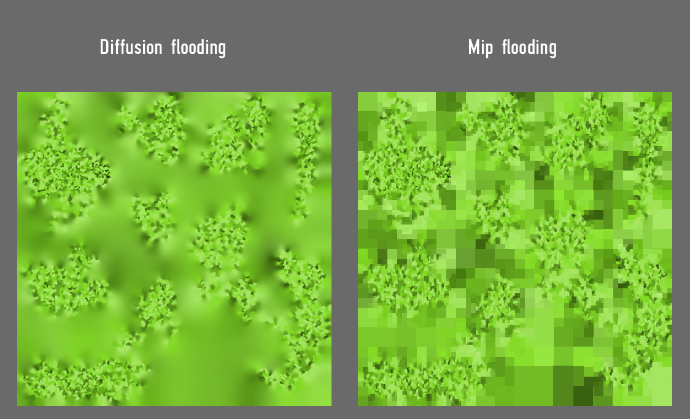

# mip-flooding

photoshop script to 'mip-flood' a transparent layer

more info: Interactive Wind and Vegetation in 'God of War' GDC 2019 https://youtu.be/MKX45_riWQA?t=2961  

just a quick experiment,the script is not production ready. 

(it works, but it's really slow since the script dublicates your original layer 20 * amount of mip levels times).

